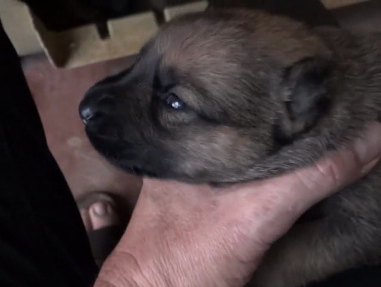

# Welcome to Anthony's Puppy Site  
## We have 9 puppies since May 29. They are located at Rusizi, Rwanda. Interested? Then [click here](contactform.html) and submit your email address, or go to the contact form at the bottom of the page!  

## This is the mother, a pure shepherd.

## This is the father. Half Ridgeback, half Shepherd.

(June 10) They have already opened their eyes: 

(Aug 3) Two months old: 

The pups will look something in between, like these from a previous litter:
fluffy, with a ridge,

short hair, with a ridge,

fluffy, no ridge. Or short hair, with no ridge. 

Here is a [video link](https://vimeo.com/221859881) (June 16, 2017)

(June 24) Another Video: [Running around, siblings cleaning them](https://vimeo.com/222985083)

If you are interested to get one of the puppies, [click here to get to the contact form](./contactform.html) and submit your email address. I'll get back to you as soon as possible! Or if you know someone who may be interested, please give them the link to this website! That's https://zorbathegreek.github.io/DazzlingDogs/ 

Anthony

P.S. [Here is something to read about dogs, life, and everything: "Don't shoot the dog"](https://archive.org/download/DontShootTheDog/Dont-shoot-the-dog.pdf)

Two books by Ian Dunbar: [Before you get your puppy](http://www.dogstardaily.com/files/downloads/BEFORE_You_Get_Your_Puppy.pdf) & [After you get your puppy](http://www.dogstardaily.com/files/downloads/AFTER_You_Get_Your_Puppy.pdf)

One by Patricia B McConnell: [The Other End of the Leash](https://www.scribd.com/doc/76581766/The-Other-End-of-the-Leash#page=26) (start reading at p 26!) (works best on laptop/PC)

